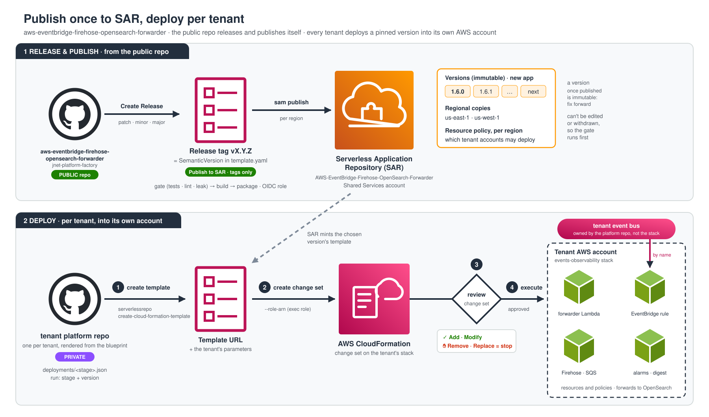

# Platform model

How a tenant platform is organised, which repository owns what, and the rules that
keep live infrastructure safe. Every platform repository rendered from
[platform-blueprint](https://github.com/jnet-platform-factory/platform-blueprint)
carries this file; change it in the blueprint, and carry the change to the tenants.

## 1. Public tooling, private configuration

```
jnet-platform-factory (PUBLIC)           tenant platform repo (PRIVATE)          AWS
┌──────────────────────────────┐        ┌────────────────────────────┐        ┌──────────┐
│ aws-account-bootstrap        │        │ configuration only:        │        │ tenant   │
│ aws-eventbridge-firehose-    │ ─pin─► │ configs, parameters,       │ ─────► │ accounts │
│   opensearch-forwarder       │        │ deployment records,        │ deploy │          │
│ aws-daily-monitoring-report  │        │ deploy/provision workflows │        │          │
│ .github (job-summary action) │        │                            │        │          │
│ platform-blueprint ─render──────────► │                            │        │          │
└──────────────────────────────┘        └────────────────────────────┘        └──────────┘
```

- **Public repositories are the source of tooling.** They hold no tenant configuration:
  no account ids, organisation repository lists, internal domains or tenant names. A
  leak gate enforces it on every pull request.
- **Each tenant has exactly one private platform repository.** It holds that tenant's
  configuration and owns its deploys and provisioning.
- **Arrows go one way.** Private repositories consume public tools **pinned** to a tag or
  a full commit, never `@main`. Public repositories never read from private ones. Only
  private repositories deploy into AWS.
- **Each tenant is its own application**, in its own AWS accounts. Nothing is shared
  between tenants except the published tooling and the SAR applications.

## 2. Accounts and environments

- **One AWS account per environment**, never shared: `dev` and `production` at least.
  The account is the boundary everything relies on — a deploy role, a permission set
  and a leaked credential each reach one account and no further.
- **The GitHub environment is named after the AWS environment.** The bootstrap's deploy
  roles trust exactly that environment, and their ARNs live in it as variables
  (`AWS_PLATFORM_ROLE_ARN`, `AWS_APP_ROLE_ARN`, `AWS_CFN_EXEC_ROLE_ARN`, `AWS_REGION`).
  A deploy is only as guarded as its environment's protection rules: `production` has
  required reviewers and allows `main` only.
- **Organisational units are named for the environment, never the product**
  (`Workloads/NonProd`, `Workloads/Prod`), so one set of SCPs serves every organisation.
  See [aws-account-bootstrap](https://github.com/jnet-platform-factory/aws-account-bootstrap).

## 3. Event buses: one per tenant, owned by the platform

Every tenant has **its own** EventBridge bus in its own account. Several of the tenant's
repositories publish to it; events-observability is **one consumer** of it: a rule plus
delivery to OpenSearch.

```
tenant account
<prefix>-events-<env>    ◄── owned by infrastructure/ (Terraform, prevent_destroy)
  ▲      ▲
  │      └─ other producers
  └─ application repositories
       │
       ▼
  events-observability stack  ← consumer, never the owner (EventBusName = the bus)
```

**The bus belongs to the platform, not to the observability stack.** If the bus lives
inside the events-observability stack, deleting or replacing that stack deletes every
producer's bus.

The published template creates a bus only when no name is given:

```yaml
Conditions:
  CreateEventBus: !Equals [!Ref EventBusName, ""]
```

CloudFormation compares resources by **logical id**. If a stack contains the bus (created
or imported into it) and a deploy passes `EventBusName=<name>`, the evaluated template
has no such resource, and the change set says **Remove**. With `DeletionPolicy: Retain`
on the live resource the bus survives, leaving the stack; then let the platform take
ownership of it by importing it into its Terraform state.

## 4. SAR: publish once, deploy per tenant



**SAR** (AWS Serverless Application Repository) is a catalogue of packaged
CloudFormation/SAM applications that other accounts can deploy.

- **One publisher: the public repository itself.** It releases (patch, minor or major),
  tags `vX.Y.Z` equal to the template's `SemanticVersion`, and publishes through an OIDC
  role that only a tag-only environment can assume.
- **Versions are immutable.** A published `SemanticVersion` can never be edited or
  withdrawn, which is why the publish gate (tests, lint, leak gate, build) is strict.
  Application names are immutable too: renaming one means a new application.
- **SAR is regional.** An application exists only in the regions it was published to,
  and a cross-region deploy fails. Its resource policy, per region, says which accounts
  may deploy it: the publisher shares each new tenant's accounts.
- **Deploying is the tenant repository's job**, into its own accounts, with its own
  parameters (`events-observability/deployments/<stage>.json`):
  1. `serverlessrepo create-cloud-formation-template` copies that version's template to a
     temporary URL;
  2. `cloudformation create-change-set` against the tenant's stack, with `--role-arn`;
  3. **read the change set** — any Remove or Replacement blocks the run unless
     deliberately overridden;
  4. execute.

## 5. Pins

| Tool                                          | Pinned by                         | Where                                  |
| --------------------------------------------- | --------------------------------- | -------------------------------------- |
| aws-account-bootstrap                         | tag **and** full commit           | `aws-account-bootstrap/Makefile`       |
| aws-eventbridge-firehose-opensearch-forwarder | SAR `SemanticVersion` (= its tag) | `events-observability/Makefile`        |
| aws-daily-monitoring-report                   | full commit (it has no tags)      | `aws-daily-monitoring-report/Makefile` |
| job-summary action                            | tag                               | every workflow's summary job           |

Every pin has a `make verify-pin` that fails when the tag no longer points at the
pinned commit, or the commit has left the tool's `main`. GitHub resolves actions when a
job starts, so a missing or moved tag fails the whole job: the summary jobs that use the
shared action run on their own, with `permissions: {}`, and `continue-on-error`.

**Moving a pin** is a reviewed change: read the tool's changes, move the pin, and read the
plan or change set it produces against every account.

## 6. Rules that protect live infrastructure

- **Never rename a live name casually.** Stack names, function names, buckets, buses and
  the names of IAM roles other policies reference are identities: renaming one makes
  CloudFormation or Terraform create a new resource and delete the old one.
- **Compare before you swap a template under a live stack**: logical ids, physical names,
  parameters and outputs. Use a change set and read it.
- **Every deploy is a change set or a plan**, created in one job and executed in another:
  in dev on merge, in production behind the environment's reviewers, from `main` only.
- **Parameter files list every parameter**, empty ones too: one left out silently takes
  the template's default, which need not be what is live. `make check` enforces it.
- **Credentials are secrets, never Actions variables** — variables are not masked. List
  variable names, never values.
- **Nothing deploys a placeholder**: every target that reaches AWS runs `make ready`
  first.

## 7. Account bootstrap

`aws-account-bootstrap/` has one config per account (`configs/<env>.env`) and a Makefile
that fetches the pinned public tool into `.tool/<sha>` and runs it.

```
make plan    ACCOUNT=<env>   # renders every document; changes nothing
make analyze ACCOUNT=<env>   # Access Analyzer + IAM simulator; read-only
make diff    ACCOUNT=<env>   # rendered against live IAM; exit 1 on drift
make apply   ACCOUNT=<env>   # changes IAM; refused for accounts in NO_APPLY
```

- **The first apply in an account is a human's**, with admin: it creates the roles CI
  would use. Then `make ci-roles` deploys the roles the bootstrap pipeline itself
  assumes, separately, so a bad apply cannot lock out the pipeline that would fix it.
- **Run `gh auth status` right before a plan or apply.** The trust policies are rendered
  from each repository's OIDC subject setting, read with `gh`; a signed-out `gh` would
  silently drop the immutable subject form, and `make github-oidc` refuses to go on.
- **Two configs for one account must agree**: every apply rewrites each trust policy from
  one config alone. `make same-account` enforces it.

## 8. Pipelines

- **Check** runs every gate that needs no AWS on every pull request and push.
- **One workflow per component**, triggered by changes to its directory: a pull request
  shows the dev plan or change set; a merge applies dev, then production behind its
  reviewers.
- **Create Release** (dispatch only) bumps the tag, creates the GitHub release and a
  `release/<tag>` branch. It needs the `CICD_ACCESS_TOKEN` secret.
- **Job summaries**: every pipeline writes one through the shared job-summary action — a
  result line, a table, links. Secrets, account ids and ARNs are never written.
